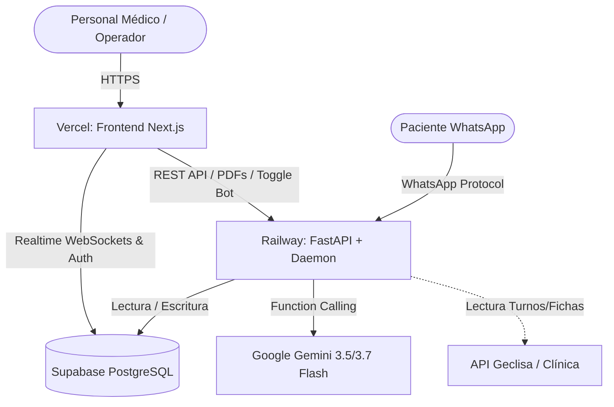

# 🚀 Guía de Despliegue en Producción: Supabase + Railway + Vercel

Este instructivo detalla el proceso paso a paso para poner en producción el **CRM Médico + Bot Agéntico de WhatsApp con Gemini** utilizando el stack cloud recomendado:
* **Base de Datos & Realtime**: [Supabase](https://supabase.com)
* **Backend API & Daemon**: [Railway](https://railway.app)
* **Frontend Web Application**: [Vercel](https://vercel.com)

---

## 🏗️ Arquitectura de Producción



---

## 📦 PASO 1: Configurar Supabase (Base de Datos)

1. Ingresá a tu consola de [Supabase Dashboard](https://supabase.com/dashboard) y abrí tu proyecto (`crm_agentico_nube` o creá uno nuevo).
2. Andá al **SQL Editor** (menú lateral izquierdo).
3. Abrí el archivo [`database/schema.sql`](./database/schema.sql) de este repositorio, copiá todo su contenido y pegalo en el SQL Editor de Supabase.
4. Hacé clic en **Run**. Esto creará:
   * Tablas: `pacientes`, `conversaciones`, `mensajes`, `nomencladores`, `servicios_precios`, `presupuestos`, `items_presupuesto`.
   * Triggers de recálculo de totales en presupuestos.
   * Publicación de **Supabase Realtime** para actualización instantánea de la mensajería.
5. Andá a **Project Settings > API** y copiá los siguientes valores:
   * **Project URL**: `https://<tu-id>.supabase.co`
   * **anon public key**: `eyJhbGciOi...`
   * **service_role secret key**: `eyJhbGciOi...`
6. Andá a **Project Settings > Database** y en la sección **Connection string > URI (Connection Pooling)** copiá la `DATABASE_URL`.

---

## ⚙️ PASO 2: Desplegar el Backend en Railway

El backend en FastAPI orquesta el agente Gemini, la generación de PDFs y la conexión con WhatsApp.

1. Asegurate de haber subido este repositorio a **GitHub**.
2. Ingresá a [Railway.app](https://railway.app) e iniciá sesión con GitHub.
3. Hacé clic en **New Project > Deploy from GitHub repo** y seleccioná el repositorio `crm_agentico_nube`.
4. Hacé clic sobre el servicio creado y andá a la pestaña **Settings**:
   * **Root Directory**: Escribí `/backend` (o `backend`).
   * **Build Command**: Dejalo automático (Railway detectará el [`backend/Dockerfile`](./backend/Dockerfile) y [`backend/railway.json`](./backend/railway.json)).
5. Andá a la pestaña **Variables** en Railway y agregá las siguientes variables de entorno:

| Variable | Valor / Descripción |
| :--- | :--- |
| `GEMINI_API_KEY` | Tu API Key de Google AI Studio |
| `SUPABASE_URL` | Tu Project URL de Supabase |
| `SUPABASE_ANON_KEY` | Tu clave `anon` de Supabase |
| `SUPABASE_SERVICE_ROLE_KEY` | Tu clave `service_role` de Supabase |
| `DATABASE_URL` | Tu URI de conexión a PostgreSQL de Supabase |
| `GECLISA_API_BASE_URL` | `https://creogeclisa.fertilidadmendoza.com.ar:98` (opcional) |
| `GECLISA_USERNAME` | Tu usuario de Geclisa (opcional) |
| `GECLISA_PASSWORD` | Tu contraseña de Geclisa (opcional) |

6. Andá a la pestaña **Settings > Networking** y hacé clic en **Generate Domain**.
   * Copiá la URL pública generada (ejemplo: `https://crm-backend-production.up.railway.app`).
7. *(Opcional - Persistencia de Sesión de WhatsApp)*:
   * En Railway, andá a **Volumes > Add Volume** y montalo en la ruta `/app` para que el archivo `neonize.db` persista si el contenedor se reinicia.

---

## 🌐 PASO 3: Desplegar el Frontend en Vercel

1. Ingresá a [Vercel.com](https://vercel.com) e iniciá sesión con GitHub.
2. Hacé clic en **Add New... > Project** e importá el repositorio `crm_agentico_nube`.
3. En la pantalla de configuración del proyecto:
   * **Framework Preset**: `Next.js` (detectado automáticamente).
   * **Root Directory**: Hacé clic en *Edit* y seleccioná la carpeta `frontend`.
4. Desplegá la sección **Environment Variables** y agregá:

| Variable | Valor |
| :--- | :--- |
| `NEXT_PUBLIC_SUPABASE_URL` | Tu Project URL de Supabase (ej: `https://<tu-id>.supabase.co`) |
| `NEXT_PUBLIC_SUPABASE_ANON_KEY` | Tu clave `anon` pública de Supabase |
| `NEXT_PUBLIC_BACKEND_URL` | La URL pública de Railway generada en el Paso 2 (ej: `https://crm-backend-production.up.railway.app`) |

5. Hacé clic en **Deploy**.
6. En unos segundos, Vercel compilará la aplicación y te entregará tu dominio de producción (ej: `https://crm-medico.vercel.app`).

---

## 🔄 PASO 4: Flujo de Actualización Automática (CI/CD)

Una vez completados los pasos anteriores, el ciclo de vida de desarrollo queda 100% automatizado:

1. Cada vez que realices cambios en tu código y ejecutes:
   ```bash
   git add .
   git commit -m "Nuevas mejoras en CRM y Bot"
   git push origin main
   ```
2. **Vercel** detectará los cambios en `frontend/` y recompilará automáticamente la interfaz web en vivo sin tiempo de inactividad (Zero Downtime).
3. **Railway** detectará los cambios en `backend/` y reconstruirá el contenedor Docker de FastAPI y el agente automáticamente.

---

## ✅ Verificación Final en Producción

1. **Dashboard**: Ingresá a tu dominio de Vercel y confirmá que carguen las estadísticas y nomencladores médicos.
2. **Chat en Vivo**: Andá a la sección `/chat` y enviá un mensaje desde el simulador para validar que Gemini responda en tiempo real conectado a Railway y Supabase.
3. **Vinculación de WhatsApp**: En `/ajustes`, verificá el estado de la pasarela de WhatsApp y la descarga de presupuestos en PDF.
