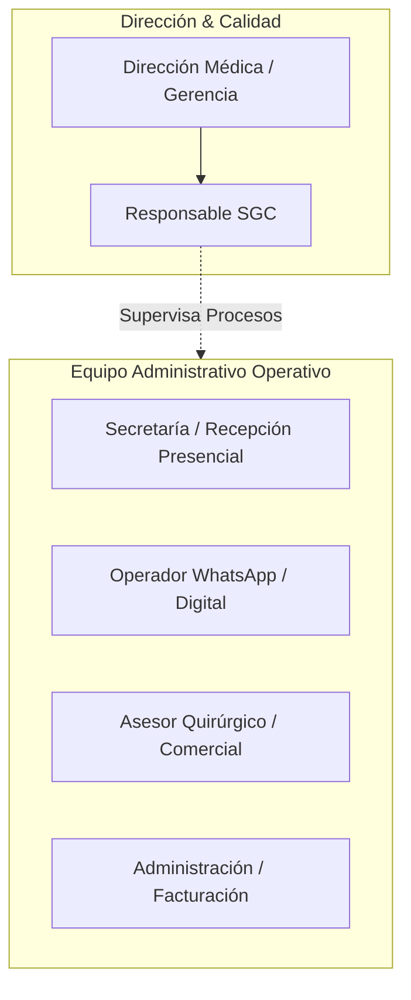
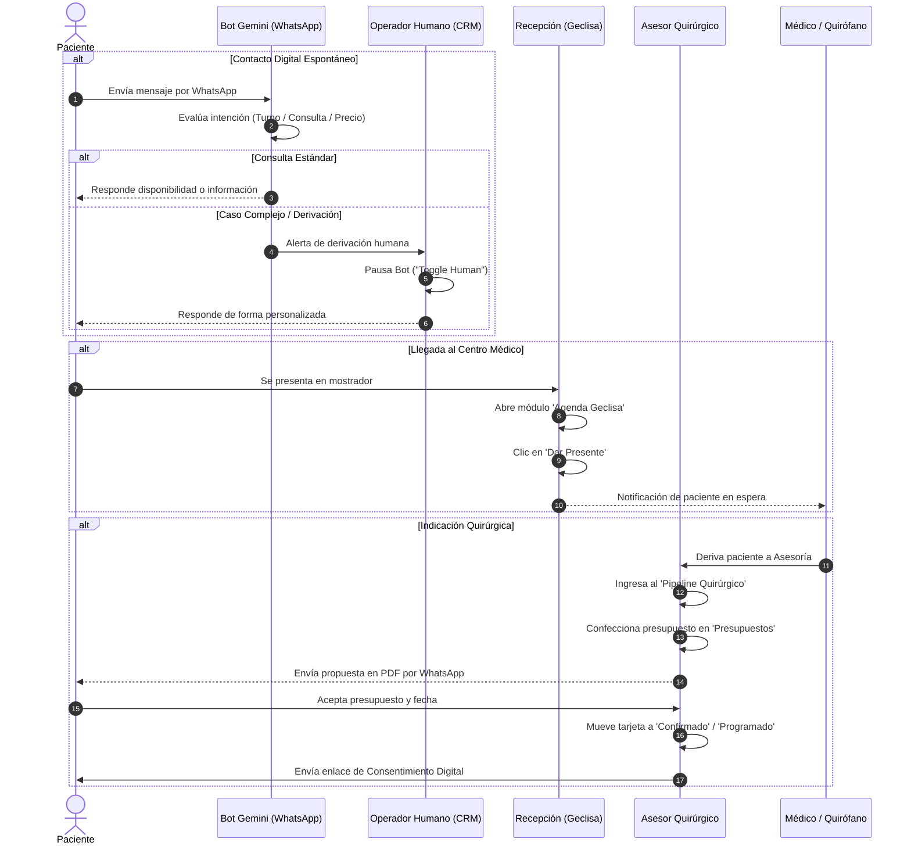
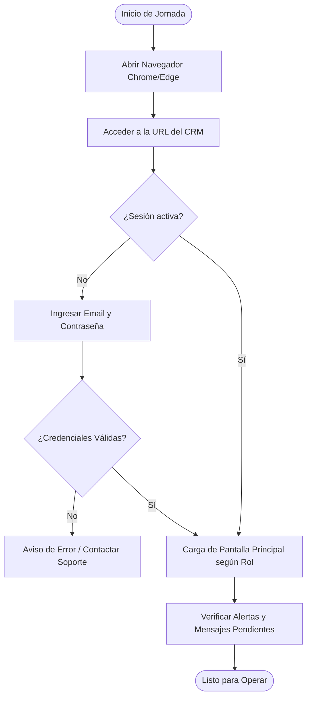
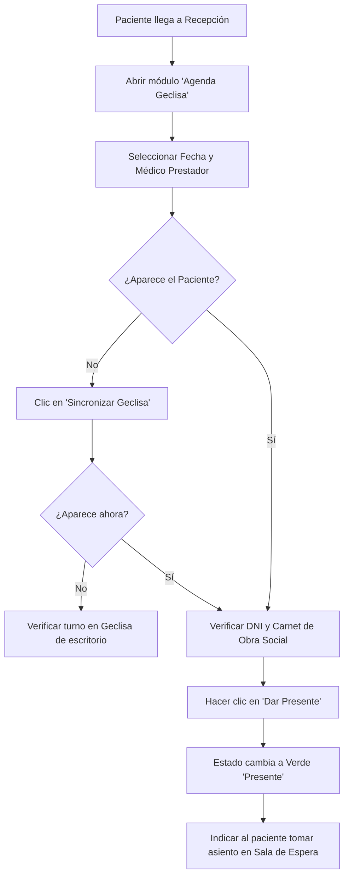
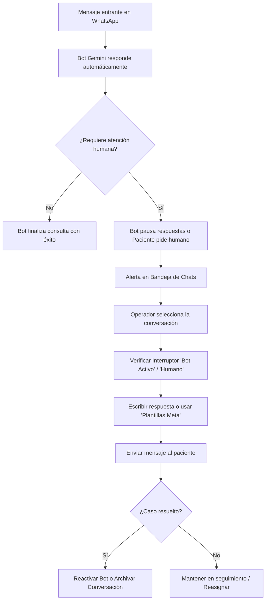
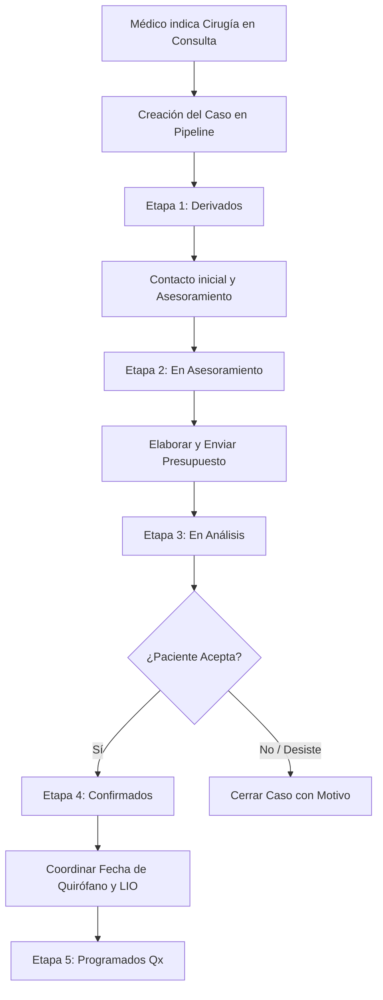
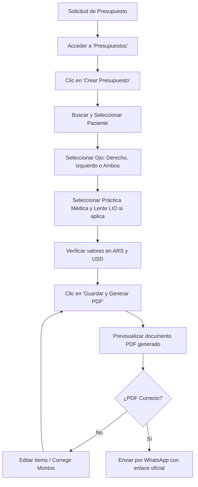
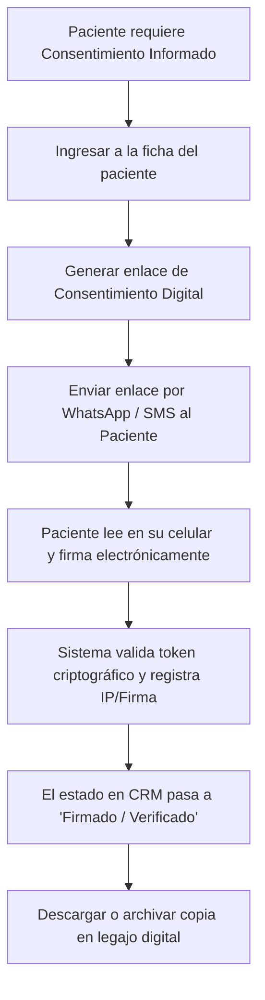
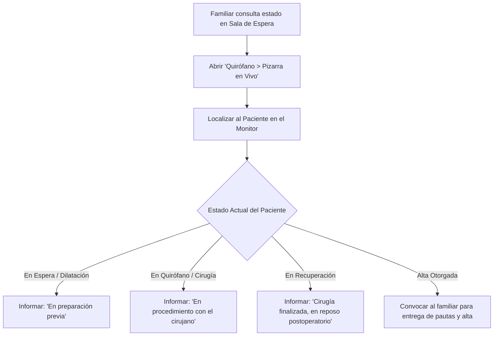
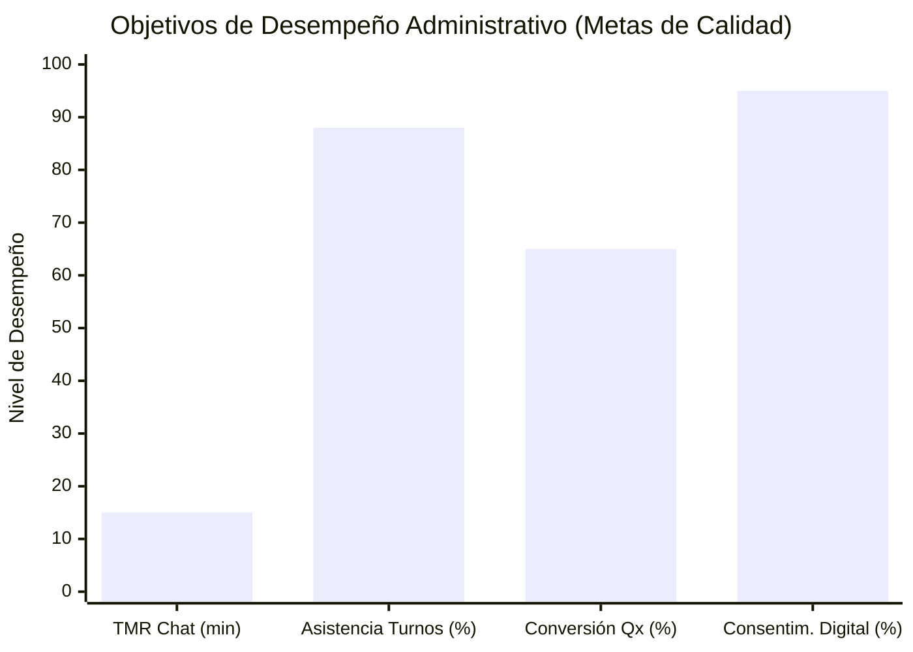

# SISTEMA DE GESTIÓN DE LA CALIDAD (SGC)
## MANUAL DE PROCEDIMIENTOS OPERATIVOS ESTANDARIZADOS (POE)

---

| **CENTRO MÉDICO / CLÍNICA OFTALMOLÓGICA** | **CÓDIGO:** SGC-POE-ADM-001 | **VERSIÓN:** 2.0 |
| :--- | :--- | :--- |
| **DOCUMENTO:** MANUAL DE PROCEDIMIENTOS ADMINISTRATIVOS | **EMISIÓN:** 23/09/2026 | **PÁGINA:** 1 de 24 |
| **PROCESO:** ADMISIÓN, ATENCIÓN AL PACIENTE Y ASESORÍA | **VIGENCIA:** 24 meses | **ESTADO:** OFICIAL VIGENTE |

---

### CONTROL DE EMISIÓN, REVISIÓN Y APROBACIÓN (ISO 9001:2015 - Cláusula 7.5)

| Acción | Responsabilidad / Puesto | Fecha | Firma / Identificador |
| :--- | :--- | :--- | :--- |
| **Elaboró:** | Coordinación Administrativa y Operativa | 23/09/2026 | Coord. Adm. Gral. |
| **Revisó:** | Responsable del Sistema de Gestión de Calidad (SGC) | 23/09/2026 | Resp. Calidad ISO |
| **Aprobó:** | Dirección Médica y Gerencia General | 23/09/2026 | Dir. Médica Institucional |

### HISTORIAL DE REVISIONES Y CONTROL DE CAMBIOS

| Versión | Fecha | Naturaleza del Cambio / Justificación | Responsable |
| :---: | :---: | :--- | :--- |
| 1.0 | 10/01/2026 | Creación inicial del manual administrativo para sistema anterior. | Secretaría Gral. |
| 2.0 | 23/09/2026 | Adaptación total a CRM Cloud con Agente Inteligente WhatsApp (Gemini), Integración Geclisa, Pipeline Quirúrgico y cumplimiento ISO 9001:2015. | SGC / Coord. Adm. |

---

## ÍNDICE GENERAL

1. [Objeto y Campo de Aplicación](#1-objeto-y-campo-de-aplicación)
2. [Referencias Normativas y Marco Legal](#2-referencias-normativas-y-marco-legal)
3. [Términos, Definiciones y Glosario](#3-términos-definiciones-y-glosario)
4. [Roles, Responsabilidades y Competencias del Personal Administrativo](#4-roles-responsabilidades-y-competencias-del-personal-administrativo)
5. [Políticas Institucionales y Seguridad de la Información](#5-políticas-institucionales-y-seguridad-de-la-información)
6. [Mapa de Procesos e Interacción en el CRM](#6-mapa-de-procesos-e-interacción-en-el-crm)
7. [Procedimientos Operativos Estandarizados (Paso a Paso)](#7-procedimientos-operativos-estandarizados-paso-a-paso)
   - 7.1. [POE-01: Autenticación, Acceso y Configuración de Sesión](#71-poe-01-autenticación-acceso-y-configuración-de-sesión)
   - 7.2. [POE-02: Gestión de Agenda Geclisa y Recepción de Pacientes (Check-in)](#72-poe-02-gestión-de-agenda-geclisa-y-recepción-de-pacientes-check-in)
   - 7.3. [POE-03: Bandeja de Entrada Multicanal de WhatsApp y Gestión de Asistente IA](#73-poe-03-bandeja-de-entrada-multicanal-de-whatsapp-y-gestión-de-asistente-ia)
   - 7.4. [POE-04: Gestión del Embudo Comercial y Asesoramiento Quirúrgico (Pipeline)](#74-poe-04-gestión-del-embudo-comercial-y-asesoramiento-quirúrgico-pipeline)
   - 7.5. [POE-05: Emisión, Control y Envío de Presupuestos Médicos](#75-poe-05-emisión-control-y-envío-de-presupuestos-médicos)
   - 7.6. [POE-06: Gestión de Expedientes de Pacientes y Consentimiento Digital](#76-poe-06-gestión-de-expedientes-de-pacientes-y-consentimiento-digital)
   - 7.7. [POE-07: Información Quirúrgica y Acompañamiento a Familiares](#77-poe-07-información-quirúrgica-y-acompañamiento-a-familiares)
8. [Gestión de Riesgos, Contingencias y Tratamiento de Salidas No Conformes](#8-gestión-de-riesgos-contingencias-y-tratamiento-de-salidas-no-conformes)
9. [Indicadores de Desempeño (KPI) y Evaluación del Proceso](#9-indicadores-de-desempeño-kpi-y-evaluación-del-proceso)
10. [Anexos y Registros de la Calidad Asociados](#10-anexos-y-registros-de-la-calidad-asociados)

---

## 1. OBJETO Y CAMPO DE APLICACIÓN

### 1.1. Objeto
Estandarizar y documentar de manera precisa y secuencial las actividades del personal administrativo vinculadas a la operación de la plataforma **CRM Cloud de Gestión Clínica y Quirúrgica**, asegurando la calidad en la atención del paciente, la confidencialidad de la información médica, la optimización de los tiempos de respuesta y la minimización de errores operativos, en estricto cumplimiento con la **Norma Internacional ISO 9001:2015**.

### 1.2. Campo de Aplicación (Alcance)
El presente procedimiento es de aplicación obligatoria para todo el personal dependiente del área de:
- **Recepción y Sala de Espera.**
- **Secretaría Médica y Turnos.**
- **Admisión y Asesoría Quirúrgica (Lead-to-Surgery).**
- **Atención al Paciente por Canales Digitales (WhatsApp / Soporte).**
- **Facturación y Emisión de Presupuestos.**

El alcance comprende desde el primer contacto digital o presencial del paciente con la institución, la coordinación de citas en Geclisa, la elaboración y seguimiento de presupuestos quirúrgicos, hasta el ingreso a quirófano y cierre administrativo.

---

## 2. REFERENCIAS NORMATIVAS Y MARCO LEGAL

Este procedimiento se fundamenta y alinea con los siguientes estándares:
1. **Norma ISO 9001:2015 (Sistemas de Gestión de la Calidad)**:
   - *Cláusula 4.4*: Sistema de gestión de la calidad y sus procesos.
   - *Cláusula 5.3*: Roles, responsabilidades y autoridades en la organización.
   - *Cláusula 7.1.3*: Infraestructura (plataforma tecnológica y conectividad).
   - *Cláusula 7.2*: Competencia del personal.
   - *Cláusula 7.5*: Información documentada (creación, actualización y control).
   - *Cláusula 8.2*: Requisitos para los productos y servicios (atención y comunicación con el paciente).
   - *Cláusula 8.5*: Producción y provisión del servicio (control de trazabilidad y preservación).
   - *Cláusula 8.7*: Control de las salidas no conformes.
   - *Cláusula 9.1*: Seguimiento, medición, análisis y evaluación del desempeño.
   - *Cláusula 10.2*: No conformidad y acción correctiva.
2. **Marco Legal de Protección de Datos Personales y Salud**:
   - Ley Nacional de Protección de Datos Personales (Ley 25.326) y Secreto Profesional Médico.
   - Ley de Derechos del Paciente en su Relación con los Profesionales e Instituciones de la Salud (Ley 26.529).

---

## 3. TÉRMINOS, DEFINICIONES Y GLOSARIO

- **CRM (Customer Relationship Management)**: Plataforma tecnológica en la nube para la gestión de las relaciones, comunicaciones y flujos de servicio con los pacientes.
- **Agente IA Gemini**: Sistema de inteligencia artificial conversacional conectado a WhatsApp que atiende consultas de primer nivel, informa disponibilidad de turnos, cotiza prestaciones y deriva casos complejos al personal humano.
- **Geclisa**: Sistema integral de historia clínica y facturación institucional de escritorio que actúa como fuente de la verdad para agendas de prestadores y turnos asignados.
- **Check-in / Dar Presente**: Acción operativa mediante la cual la recepción confirma la llegada física del paciente al centro médico, informando automáticamente al consultorio médico.
- **Intervención Humana (Toggle Human)**: Funcionalidad del CRM que suspende de manera temporal o definitiva la respuesta automática del bot de IA en una conversación específica para permitir que un operador humano tome el control exclusivo.
- **Pipeline Quirúrgico (Lead-to-Surgery)**: Tablero visual interactivo (Kanban) que gestiona el ciclo de vida del paciente desde que se le prescribe una intervención quirúrgica hasta que se opera y asiste a su control postoperatorio.
- **SLA (Service Level Agreement - Nivel de Servicio)**: Tiempo máximo estandarizado admisible para realizar el contacto, seguimiento o resolución de un requerimiento administrativo.
- **LIO**: Lente Intraocular implantado en procedimientos quirúrgicos oftalmológicos (catarata, presbicia o refractiva).
- **Consentimiento Informado Digital**: Declaración de voluntad del paciente o representante legal firmada digital o electrónicamente antes de un procedimiento invasivo o quirúrgico.
- **RBAC (Role-Based Access Control)**: Control de accesos y permisos en el sistema según el rol funcional asignado al colaborador.

---

## 4. ROLES, RESPONSABILIDADES Y COMPETENCIAS

### 4.1. Matriz de Responsabilidades (RACI)

| Actividad / Proceso | Recepción Presencial | Operador WhatsApp | Asesor Quirúrgico | Facturación | Supervisor / TI |
| :--- | :---: | :---: | :---: | :---: | :---: |
| Inicio y cierre de sesión seguro | **R / A** | **R / A** | **R / A** | **R / A** | **I** |
| Verificación de turnos y Check-in Geclisa | **R / A** | **C** | **I** | **I** | **I** |
| Triage de chats y pausa/reanudación de IA | **I** | **R / A** | **C** | **I** | **C** |
| Elaboración de presupuestos médicos | **C** | **C** | **R** | **A** | **I** |
| Envío de presupuestos por WhatsApp/Email | **I** | **C** | **R / A** | **C** | **I** |
| Actualización de etapas en Pipeline | **I** | **I** | **R / A** | **I** | **I** |
| Verificación de Consentimientos Informados | **R** | **I** | **R / A** | **I** | **I** |
| Tratamiento de incidencias operativas | **R** | **R** | **R** | **R** | **A** |

*Nomenclatura: **R** = Responsable de ejecución, **A** = Aprobador / Responsable final, **C** = Consultado, **I** = Informado.*

### 4.2. Competencias Mínimas Requeridas
- Formación básica en herramientas ofimáticas y navegación web moderna.
- Capacitación acreditada en el manejo del CRM Cloud y vinculación con Geclisa.
- Capacitación en confidencialidad médica, secreto profesional y protección de datos.
- Habilidades de comunicación asertiva y empatía en la atención de pacientes.

---

## 5. POLÍTICAS INSTITUCIONALES Y SEGURIDAD DE LA INFORMACIÓN

1. **Credenciales Personales e Intransferibles**: Queda estrictamente prohibido compartir usuarios, contraseñas o enlaces de autenticación. Toda acción registrada en el CRM queda vinculada a la cuenta individual en el registro de auditoría (`Logs`).
2. **Bloqueo Automático por Inactividad**: Las estaciones de trabajo administrativas deben bloquearse al ausentarse del puesto. El CRM cuenta con cierre de sesión por inactividad conforme a las directivas de seguridad.
3. **Prohibición de Uso de Celulares Particulares**: Las comunicaciones con pacientes se realizan única y exclusivamente mediante la consola del CRM o el WhatsApp institucional corporativo. Queda vetado el contacto por canales personales de mensajería.
4. **Política de Respeto al Lenguaje y Empatía**: Las comunicaciones escritas en WhatsApp deben mantener tono profesional, cálido y protocolar, respetando las plantillas oficiales preaprobadas por la Dirección Médica.
5. **Principio de Doble Verificación**: Antes de confirmar una cirugía o emitir un presupuesto definitivo, el personal debe validar: Identidad completa (Nombre y DNI), Cobertura Médica / Obra Social, y Ojo / Práctica indicada por el cirujano.

---

## 6. MAPA DE PROCESOS E INTERACCIÓN EN EL CRM

---

## 7. PROCEDIMIENTOS OPERATIVOS ESTANDARIZADOS (PASO A PASO)

---

### 7.1. POE-01: Autenticación, Acceso y Configuración de Sesión

* **Código:** POE-ADM-01
* **Responsable:** Todo el personal administrativo.
* **Frecuencia:** Diaria / Al inicio de cada turno de trabajo.

#### Diagrama de Flujo:

#### Paso a Paso Detallado:
1. **Acceso al Navegador**: Utilizar exclusivamente Google Chrome o Microsoft Edge en su versión actualizada.
2. **Ingreso a la Plataforma**: Dirigirse a la URL oficial del CRM: `https://crm.tuclinica.com` (o la dirección interna asignada).
3. **Inicio de Sesión**:
   - Ingresar el correo electrónico corporativo provisto por la institución.
   - Digitar la contraseña segura asignada.
   - Presionar el botón **"Iniciar Sesión"**.
4. **Verificación de Perfil**:
   - Al ingresar, constatar en la esquina superior/inferior del menú lateral que el nombre del usuario y el rol visible coincidan con el puesto asignado (ej. *Recepción*, *Asesoría Quirúrgica*, *Administración*).
5. **Cierre de Turno / Salida**:
   - Al finalizar la guardia o jornada laboral, hacer clic en el botón **"Cerrar Sesión"** (ícono de puerta/cerradura en la barra lateral) para evitar accesos no autorizados.

---

### 7.2. POE-02: Gestión de Agenda Geclisa y Recepción de Pacientes (Check-in)

* **Código:** POE-ADM-02
* **Responsable:** Recepción / Secretaría de Mostrador.
* **Frecuencia:** Continua durante el horario de atención al público.

#### Diagrama de Flujo:

#### Paso a Paso Detallado:
1. **Acceso al Módulo**:
   - En el menú lateral izquierdo, hacer clic en **"Agenda Geclisa"** (ícono de calendario).
2. **Selección del Profesional y Fecha**:
   - En la parte superior, verificar que la fecha corresponda al día de la fecha. Si el paciente asiste con turno previo de otra fecha, navegar mediante el selector de fechas.
   - En el menú desplegable de prestadores, seleccionar el profesional con quien el paciente tiene el turno (o "Todos los Médicos" si su perfil cuenta con dicha facultad).
3. **Búsqueda del Paciente en Grilla**:
   - El sistema lista los turnos organizados por horario, nombre del paciente, número de ficha, obra social y tipo de práctica.
   - Utilizar la barra de búsqueda rápida ingresando el apellido o DNI del paciente para localizarlo de forma inmediata.
4. **Sincronización en Tiempo Real**:
   - Si el turno fue otorgado recientemente en el sistema de escritorio Geclisa y aún no se refleja en pantalla, hacer clic en el botón superior **"Sincronizar Geclisa"** (ícono de flechas circulares). El CRM forzará la actualización directa vía API en menos de 3 segundos.
5. **Recepción Física y Check-in**:
   - Solicitar al paciente su Documento de Identidad y credencial de cobertura médica.
   - En la fila del paciente correspondiente, hacer clic en el botón **"Dar Presente"** (ícono verde de check).
   - El indicador del turno pasará automáticamente a estado **"Presente"** con una marca horaria exacta.
   - El médico asignado visualizará instantáneamente en su monitor que el paciente ya se encuentra listo para ingresar.
6. **Casos Especiales (Sobreturnos o Turnos Espontáneos)**:
   - Todo sobreturno debe ser cargado previamente en Geclisa escritorio y luego sincronizado en el CRM para preservar la correlación de fichas clínicas y facturación.

---

### 7.3. POE-03: Bandeja de Entrada Multicanal de WhatsApp y Gestión de Asistente IA

* **Código:** POE-ADM-03
* **Responsable:** Operador de Atención Digital / Secretaría de WhatsApp.
* **Frecuencia:** Continua durante el horario de guardia digital.

#### Diagrama de Flujo:

#### Paso a Paso Detallado:
1. **Ingreso a la Bandeja de Entrada**:
   - En el menú lateral, seleccionar **"Chats / WhatsApp"** (ícono de mensaje).
   - La pantalla presenta a la izquierda el listado de conversaciones activas, al centro el historial de mensajes interactivo y a la derecha la ficha rápida del paciente.
2. **Identificación de Estados y Triage**:
   - **Ícono de Robot Verde**: La conversación está siendo atendida en tiempo real por el Agente de IA Gemini.
   - **Ícono de Usuario Azul / Alerta Naranja**: La conversación ha sido derivada o requiere intervención de un operador humano.
   - **Contador de Mensajes No Leídos**: Aparece como un distintivo numérico rojo en la barra lateral.
3. **Pausar el Asistente IA (Toma de Control Humano)**:
   - Al ingresar a una conversación donde el paciente solicita un agente o manifiesta una consulta médica compleja:
     - Localizar en el encabezado superior del chat el interruptor **"Bot IA / Intervención Humana"** (`ToggleHuman`).
     - Al hacer clic, el botón cambiará a modo **"Humano Activo"** (color azul/ámbar). El bot Gemini detendrá inmediatamente sus respuestas automáticas para este número telefónico.
4. **Redacción y Envíos de Mensajes**:
   - Escribir en la barra de texto inferior.
   - **Formato Rápido**: Se pueden utilizar herramientas de formato (negrita, cursiva, viñetas) y emojis.
   - **Respuestas Rápidas**: Hacer clic en el ícono de rayo (`Quick Replies`) para insertar textos institucionales predefinidos (saludos, formas de pago, ubicación de la sede, preparaciones de estudios).
   - **Archivos Adjuntos**: Utilizar el ícono de clip para adjuntar órdenes médicas, instrucciones prequirúrgicas o comprobantes en formato PDF, JPG o PNG.
5. **Uso de Plantillas Oficiales de WhatsApp (Meta Templates)**:
   - Cuando una conversación haya superado la ventana reglamentaria de 24 horas de Meta desde el último mensaje del paciente:
     - El sistema advertirá la necesidad de utilizar una plantilla homologada.
     - Hacer clic en el botón **"Plantillas Meta"** (`ModalSelectorPlantillasMeta`).
     - Elegir la categoría (Recordatorio de Turno, Aviso Quirúrgico, Envío de Presupuesto) y completar las variables obligatorias.
     - Presionar **"Enviar Plantilla"**.
6. **Reactivación del Bot de IA**:
   - Una vez atendida y resuelta la duda puntual del paciente, si corresponde que el bot continúe gestionando futuras consultas automáticas, volver a alternar el interruptor a **"Bot IA Activo"**.

---

### 7.4. POE-04: Gestión del Embudo Comercial y Asesoramiento Quirúrgico (Pipeline)

* **Código:** POE-ADM-04
* **Responsable:** Asesor Quirúrgico / Admisión.
* **Frecuencia:** Diaria con revisiones al inicio y final del día.

#### Diagrama de Flujo:

#### Paso a Paso Detallado:
1. **Acceso al Tablero Pipeline**:
   - En el menú lateral, seleccionar **"Asesoramiento > Pipeline"**.
   - El sistema despliega un tablero Kanban con 5 columnas activas:
     1. **Derivados**: Pacientes recién derivados desde consultorio médico.
     2. **En Asesoramiento**: En proceso de contacto inicial, asesoría clínica y explicación del procedimiento.
     3. **En Análisis**: Paciente evaluando presupuesto, financiamiento o cobertura de prepaga.
     4. **Confirmados**: Cirugía confirmada por el paciente (pendiente slot quirúrgico y seña/pago).
     5. **Programados Qx**: Cirugía con fecha, sala y equipo quirúrgico asignado.
2. **Recepción del Día (Pacientes Presenciales para Asesoría)**:
   - Si el asesor atiende en sede física, cambiar a la pestaña **"Recepción del Día"** para visualizar los pacientes que el médico acaba de derivar desde consultorio y se encuentran en sala de espera.
   - Hacer clic en **"Llamar Paciente"** y marcar **"En Atención"**.
3. **Mover Etapas del Caso (Arrastrar y Soltar)**:
   - A medida que avanza la gestión comercial con el paciente, hacer clic sobre la tarjeta y arrastrarla a la columna subsiguiente, o abrir el caso y modificar el desplegable de etapa.
4. **Control de Alertas y Semáforo de SLA (Tiempos de Inactividad)**:
   - **Borde Gris/Neutro**: Dentro del tiempo estándar de seguimiento.
   - **Borde Ámbar / Alerta**: El caso lleva más de $X$ días sin contacto registrado (según SLA configurado). Exige contactar al paciente en el día.
   - **Borde Rojo / Crítico**: Caso estancado que superó el tiempo máximo tolerable. Requiere llamada prioritaria del asesor o reasignación por parte de supervisión.
5. **Cierre de Casos**:
   - **Caso Operado / Exitoso**: Al concretarse la intervención y el postoperatorio, archivar como operado.
   - **Caso No Concretado / Desistido**: Hacer clic en el botón de cerrar caso (`ModalCerrarCasoQuirurgico`), seleccionar obligatoriamente el motivo normalizado (Económico, Falta de Cobertura, Prefiere postergar, Operado en otra institución) y registrar notas de cierre para control estadístico de calidad.

---

### 7.5. POE-05: Emisión, Control y Envío de Presupuestos Médicos

* **Código:** POE-ADM-05
* **Responsable:** Facturación / Asesoría Quirúrgica.
* **Frecuencia:** A demanda / Cada vez que se indique una práctica quirúrgica.

#### Diagrama de Flujo:

#### Paso a Paso Detallado:
1. **Acceso al Cotizador**:
   - En el menú principal, ingresar a **"Presupuestos"** (pestaña **"Crear Presupuesto"**).
2. **Identificación del Paciente**:
   - En el campo de búsqueda de paciente, escribir nombre, apellido o DNI.
   - Si el paciente es nuevo y no figura en la base, presionar **"Nuevo Paciente"** y completar sus datos mínimos obligatorios (Nombre completo, Teléfono celular con código de área y Obra Social/Prepaga).
3. **Configuración Quirúrgica**:
   - **Lateralidad (Ojo)**: Seleccionar **OD** (Ojo Derecho), **OI** (Ojo Izquierdo) o **AO** (Ambos Ojos).
   - **Práctica / Nomenclador**: Seleccionar la práctica quirúrgica prescripta (ej. *Facoemulsificación con Implante de LIO*, *Cirugía Refractiva LASIK*, *Vitrectomía*).
   - **Selección de LIO (Lente Intraocular)**: En cirugías de catarata/presbicia, seleccionar del catálogo oficial el modelo correspondiente (Monofocal, Tórico, Multifocal, PanOptix, Vivity, etc.). El sistema ajustará automáticamente el costo del insumo según la cotización vigente.
4. **Desglose de Moneda y Condiciones de Pago**:
   - El sistema calcula los subtotales en Pesos Argentinos (ARS) y Dólares Estadounidenses (USD).
   - Verificar si corresponde aplicar coberturas parciales de prepagas o reintegros.
5. **Generación del Documento Formal (PDF)**:
   - Presionar el botón **"Generar Presupuesto Formal"**.
   - El CRM compila automáticamente el documento institucional con membrete oficial, logotipo de la clínica, detalle de prestaciones, fecha de vencimiento (15 o 30 días según política) y firma del centro médico.
6. **Previsualización y Envío**:
   - Hacer clic en el ícono de ojo para abrir el **Visor de PDF**. Comprobar que no existan errores de tipeo ni aranceles discordantes.
   - Presionar **"Enviar por WhatsApp"** (`ModalEnviarPresupuestoWhatsApp`).
   - El sistema abrirá la ventana con el mensaje prearmado que incluye el nombre del paciente, resumen de la propuesta y enlace seguro de descarga del PDF.
   - Confirmar el envío. El estado del presupuesto pasará automáticamente de *Borrador* a *Enviado*.

---

### 7.6. POE-06: Gestión de Expedientes de Pacientes y Consentimiento Digital

* **Código:** POE-ADM-06
* **Responsable:** Recepción / Asesoría Quirúrgica.
* **Frecuencia:** En cada admisión y previo a actos quirúrgicos.

#### Diagrama de Flujo:

#### Paso a Paso Detallado:
1. **Búsqueda del Expediente**:
   - Ingresar a **"Pacientes"** (ícono de usuarios) y buscar por DNI o Nombre.
   - Hacer clic sobre el paciente para abrir su expediente integral.
2. **Verificación de Datos de Filiación**:
   - Constatar que el número de teléfono celular cuente con el formato internacional válido (+54 9...).
   - Validar que conste el correo electrónico y la cobertura médica actualizada.
3. **Gestión de Consentimientos Informados Digitales**:
   - En la sección quirúrgica del paciente, hacer clic en **"Generar Consentimiento Informado"**.
   - Seleccionar el tipo de procedimiento (Cataratas, Cirugía Refractiva, Inyecciones Intravítreas, etc.).
   - Hacer clic en **"Enviar Token de Firma"**. El sistema despachará un enlace seguro de un solo uso por WhatsApp al paciente.
4. **Verificación de la Firma**:
   - El paciente accede desde su dispositivo móvil, lee los riesgos y beneficios de la práctica y plasma su firma en pantalla.
   - En el CRM, el estado del consentimiento se actualizará en tiempo real a **"Firmado y Válido"** con fecha, hora, hash de seguridad y dirección IP registrada.
   - Ningún paciente podrá ingresar a quirófano sin que conste la verificación en verde del consentimiento firmado.

---

### 7.7. POE-07: Información Quirúrgica y Acompañamiento a Familiares

* **Código:** POE-ADM-07
* **Responsable:** Personal de Mostrador de Quirófano / Sala de Espera Quirúrgica.
* **Frecuencia:** Días de actividad quirúrgica.

#### Diagrama de Flujo:

#### Paso a Paso Detallado:
1. **Consulta del Estado Intraoperatorio**:
   - Ingresar a **"Quirófano > Pizarra en Vivo"** (`/quirofano-en-vivo`).
   - El sistema exhibe en tiempo real la situación de cada paciente en quirófano:
     - **En Espera / Pre-Qx**: En sala de preparación y dilatación de pupilas.
     - **En Sala / Quirófano**: Procedimiento quirúrgico en curso.
     - **En Recuperación**: Cirugía concluida, recuperación anestésica y reposo.
     - **Alta Médica**: Paciente listo para egresar con su acompañante.
2. **Información a Familiares**:
   - Proporcionar información oportuna, tranquilizadora y precisa al familiar, basándose estrictamente en el estado verificado en la pizarra en vivo.
   - Prohibido emitir diagnósticos o detalles médicos técnicos; remitir siempre al médico cirujano para el parte médico postquirúrgico formal.

---

## 8. GESTIÓN DE RIESGOS, CONTINGENCIAS Y SALIDAS NO CONFORMES

En cumplimiento con la **Cláusula 6.1 (Acciones para abordar riesgos y oportunidades)** y la **Cláusula 8.7 (Control de las salidas no conformes)** de la norma ISO 9001:2015, se definen los siguientes protocolos de contingencia operativa:

| Riesgo / Incidencia Identificada | Severidad | Causa Raíz Probable | Procedimiento de Contingencia Operativa | Responsable |
| :--- | :---: | :--- | :--- | :--- |
| **Desvinculación del Gateway de WhatsApp (Sesión QR cerrada)** | Alta | Actualización de WhatsApp, cierre de sesión en teléfono máster o corte de energía. | 1. El CRM mostrará alerta de desconexión. 2. Contactar de inmediato al Administrador de TI. 3. Re-escanear código QR desde terminal/consola en Railway. 4. Los mensajes acumulados ingresarán en cuanto se restaure la sesión. | Operador Digital / TI |
| **Falla de Comunicación con Geclisa (Error de Sincronización)** | Media | Caída de red local del servidor Geclisa o microcorte de internet en sede. | 1. No desesperar: utilizar el sistema Geclisa de escritorio como respaldo inmediato. 2. Registrar la recepción manualmente en Geclisa. 3. En cuanto retorne la red, presionar **"Sincronizar Geclisa"** para reconciliar el CRM. | Recepción / Soporte TI |
| **Respuesta Equívoca o Imprecisa del Agente IA Gemini** | Media | Consulta ambigua del paciente o caso fuera de directivas estándar. | 1. Ingresar de inmediato al chat y pulsar **"Pausar Bot (Modo Humano)"**. 2. Enviar mensaje correctivo aclarando el error de forma cálida. 3. Registrar la incidencia en la planilla de mejora continua para reajuste del prompt de IA. | Operador WhatsApp / Calidad |
| **Presupuesto Emitido con Valores Incorrectos** | Alta | Error involuntario en la selección de LIO o arancel de práctica. | 1. No enviar el PDF al paciente si se detecta a tiempo. 2. Si ya fue enviado, contactar telefónicamente de inmediato al paciente informando de la rectificación por actualización de sistema. 3. En el CRM, generar un nuevo presupuesto rectificativo y anular el anterior indicando el motivo en el campo observaciones. | Asesor Quirúrgico / Facturación |
| **Caída General de Conexión a Internet en la Clínica** | Crítica | Falla de proveedor ISP externo de telecomunicaciones. | 1. Activar red de respaldo (4G/5G celular o segundo enlace redundante). 2. El CRM opera en la nube pública (Vercel/Railway), por lo que se puede acceder desde dispositivos con datos móviles autorizados. | Dirección / TI |

---

## 9. INDICADORES DE DESEMPEÑO (KPI) Y EVALUACIÓN DEL PROCESO

Para dar cumplimiento a la **Cláusula 9.1 (Seguimiento, medición, análisis y evaluación)** de la norma ISO 9001:2015, la Dirección y el área de Calidad monitorearán mensualmente los siguientes indicadores extraídos directamente de las tablas del CRM:

### Tabla de Indicadores de Calidad del Proceso Administrativo:

| Indicador (KPI) | Fórmula de Cálculo | Meta Institucional | Frecuencia de Medición | Fuente de Datos en CRM |
| :--- | :--- | :---: | :---: | :--- |
| **Tiempo Medio de Respuesta en Chat (TMR)** | $\frac{\sum \text{Tiempo de espera del paciente hasta respuesta humana}}{\text{Total de derivaciones}}$ | $\le 15 \text{ minutos}$ | Semanal / Mensual | Módulo de Chats / Logs de Mensajes |
| **Tasa de Asistencia a Consultas (No-Show reducido)** | $\frac{\text{Turnos con Check-in (Presentes)}}{\text{Total de turnos agendados en Geclisa}} \times 100$ | $\ge 85\%$ | Mensual | Módulo Agenda Geclisa |
| **Tasa de Conversión de Presupuestos Quirúrgicos** | $\frac{\text{Casos en Etapa 'Confirmado'/'Programado'}}{\text{Total de Presupuestos Emitidos}} \times 100$ | $\ge 60\%$ | Mensual | Módulo Pipeline Quirúrgico |
| **Eficacia de Consentimientos Informados Digitales** | $\frac{\text{Cirugías con Consentimiento Digital Verificado}}{\text{Total de Cirugías Realizadas}} \times 100$ | $100\%$ *(Mandatorio)* | Quincenal / Mensual | Módulo Pacientes / Quirófano |
| **Tasa de Satisfacción y Retención de Pacientes** | $\frac{\text{Encuestas Digitales Favorables (Puntaje 4 o 5)}}{\text{Total de Encuestas Respondidas}} \times 100$ | $\ge 90\%$ | Trimestral | Mensajería Pos-Atención WhatsApp |

---

## 10. ANEXOS Y REGISTROS DE LA CALIDAD ASOCIADOS

En conformidad con la **Cláusula 7.5.3 (Control de la información documentada)**, los siguientes registros generados por el uso del sistema deben preservarse de forma íntegra, inalterable y protegida:

1. **REG-ADM-01**: Registro Histórico de Conversaciones de WhatsApp (almacenado en tabla `mensajes` de Supabase con respaldo transaccional en la nube). Tiempo de retención: 24 meses.
2. **REG-ADM-02**: Registro de Turnos y Presentismo (almacenado en base de datos Geclisa y sincronizado en CRM). Tiempo de retención: Conforme a ley de historias clínicas.
3. **REG-ADM-03**: Legajo Digital de Presupuestos Médicos emitidos (archivos PDF con numeración correlativa y código hash institucional). Tiempo de retención: 5 años.
4. **REG-ADM-04**: Registro de Trazabilidad y Firmas de Consentimiento Informado Digital (tabla `consentimientos` con token criptográfico e IP). Tiempo de retención: 10 años (período de prescripción médica legal).
5. **REG-ADM-05**: Pistas de Auditoría y Logs del Sistema (`auditoria_sistema` y eventos de acceso de usuarios). Tiempo de retención: 12 meses.

---

### DECLARACIÓN DE CONFORMIDAD Y COMPROMISO DEL PERSONAL

*El presente manual forma parte integral de la documentación del Sistema de Gestión de la Calidad de la institución. Todo el personal administrativo declara haber recibido capacitación formal sobre sus contenidos, obligándose a ejecutar sus funciones de acuerdo con los procedimientos aquí descritos.*

**Fin del Documento - SGC-POE-ADM-001 Rev. 2.0**
